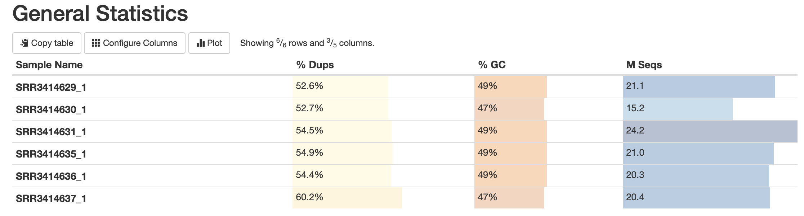
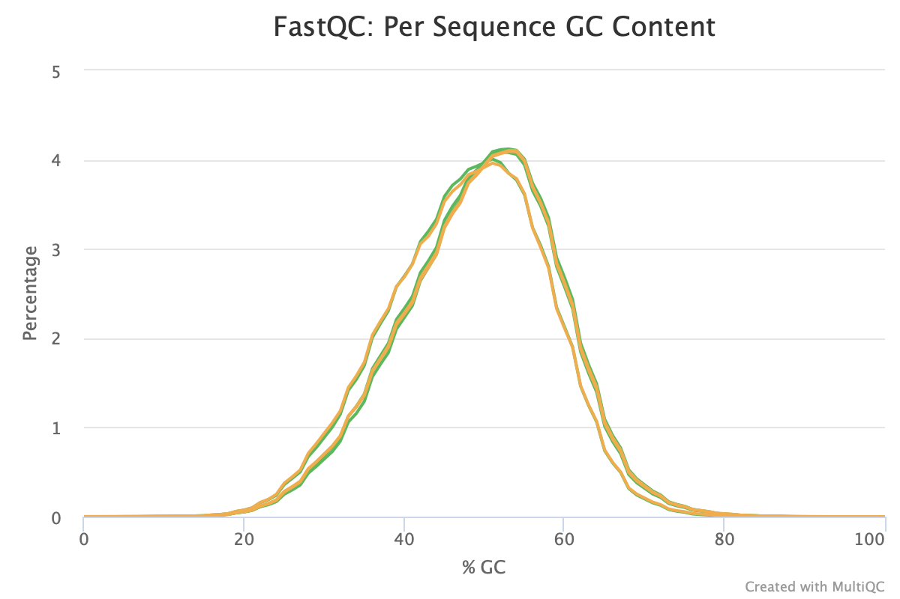
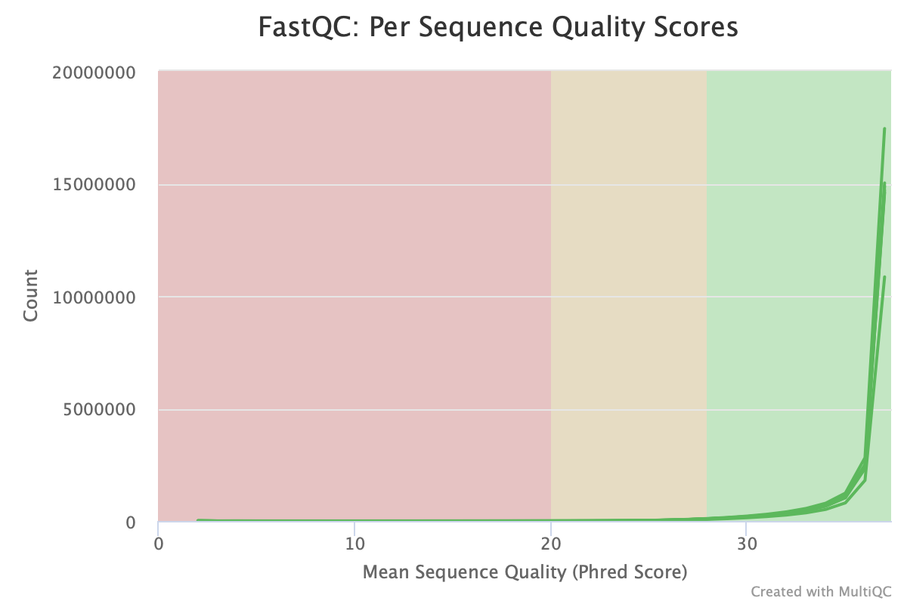
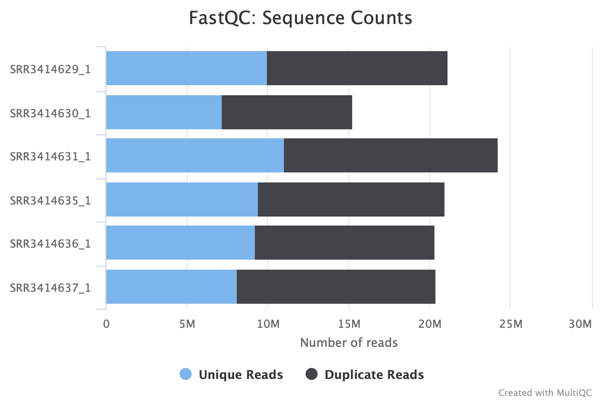
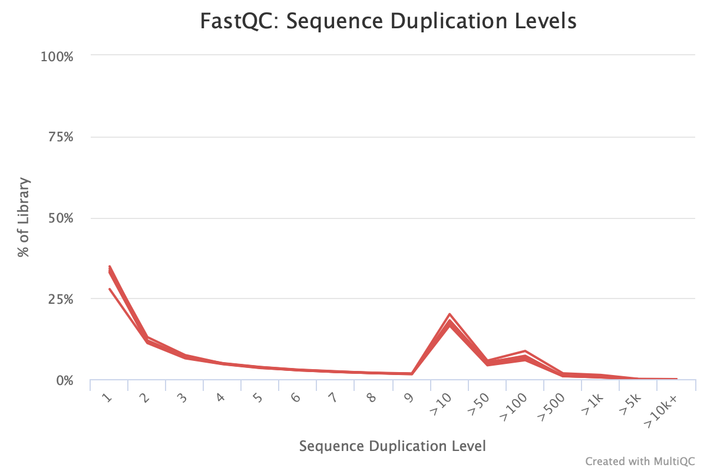

# HW4 Aksenov Yaroslav

[Ссылка на ноутбук](https://colab.research.google.com/drive/17KPQUjDH861rAK9wCGGIFAEhJ8TjkhHO?usp=sharing)

 

| ID | Тип образца | Общее кол-во исходных чтений | Кол-во чтений, которые были успешно откартированы на геном (не уникально) | Процент (не уникально) | Кол-во чтений, которые были успешно откартированы на геном (уникально) | Процент (уникально) | Общее кол-во чтений, которые попали на гены |
|----------|:-------:|:----------------:|:----------------:|:----------------:|:----------------:|:----------------:|:----------------:|
| **SRR3414635** | control | 20956475 | 10395865 | 97% | 18428317 | 88% | 16275997 |
| **SRR3414636** | control | 20307147 | 19757059 | 97% | 17825380 | 87% | 15757580 |
| **SRR3414637** | control | 20385570 | 19847291 | 97% | 17844858 | 87% | 15736978 |
| **SRR3414629** | reprogr | 21106089 | 20510113 | 97% | 18375888 | 87% | 16049609 |
| **SRR3414630** | reprogr | 15244711 | 14832680 | 97% | 13186139 | 86% | 11465324 |
| **SRR3414631** | reprogr | 24244069 | 23547686 | 97% | 20928945 | 86% | 18408851 |