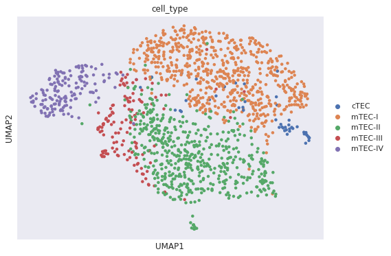

# HW5 Aksenov Yaroslav

[Ссылка на ноутбук](https://colab.research.google.com/drive/1n8qeBdDAoR9SDIJjg4ZI9uOu4HRI9Y83?usp=sharing)

# Нормализация
Использовался метод TPM, где длина транскрипции была убрана, так как она нам неизвестна, получилась следующая формула:

  - риды попавшие на транскрипцию  

# Полученные графики

На графике видим 5 кластеров.

Разбили на группы cTEC, mTEC-III, mTEC-IV, mTEC-I, mTEC-II понизили размерность данных.

